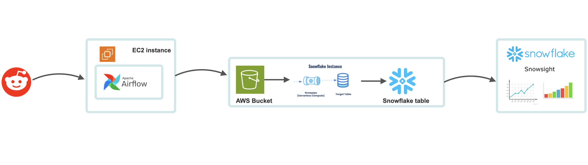

# Reddit_NBA_Analytics_ETL_Pipeline

This project delivers a robust data pipeline solution designed to extract, transform, and load (ETL) Reddit data into a Snowflake data warehouse. The pipeline ensures efficient data processing and seamless integration for advanced analysis and visualization by leveraging a powerful combination of tools and services such as Apache Airflow, Amazon EC2, Amazon S3, and Snowflake.

## Architecture

### Reddit Data Pipeline
The Reddit data pipeline focuses on extracting, transforming, and loading Reddit data into a Snowflake data warehouse. The pipeline is built using:

1. **Apache Airflow:** Orchestrates the entire ETL process, managing task dependencies and scheduling.
2. **Amazon EC2:** Provides the computational power necessary to run the ETL tasks.
3. **Amazon S3:** Serves as intermediate storage for data before loading it into Snowflake.
4. **Snowflake:** Acts as the data warehouse where transformed data is stored for analysis.

#### ETL Process for Reddit Data:
1. **Extraction:** Real-time Reddit data is fetched using Python scripts that leverage the Reddit API.
2. **Transformation:** The raw data undergoes cleaning and transformation using Pandas to ensure it meets the required schema and quality standards.
3. **Loading:** Transformed data is stored in Amazon S3, and subsequently loaded into Snowflake using Snowpipe for continuous data loading.

## Prerequisites
- AWS Account with appropriate permissions for S3.
- Snowflake account
- Reddit API credentials.
- Python 3.9 or higher
